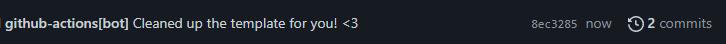
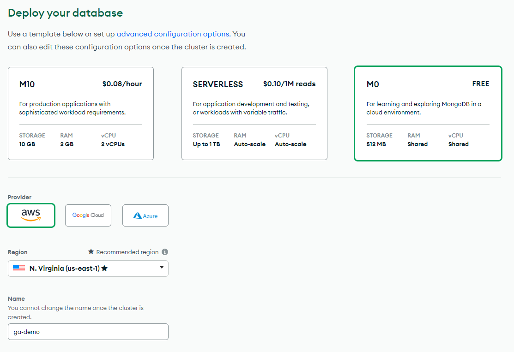

# Deploying Expressjs to Vercel
Vercel is a great platform for deploying both frontend and serverless backend applications. Vercel provides industry leading dev tooling with a great integration with github, making continuous deployment easy.

In this guide you'll learn how to deploy an ExpressJS app to vercel running as a serverless app.

> **Note!**:
> - When express is running on vercel, it is running in a serverless environment which makes this deployment not suitable for things like websockets or other long-lasting / stateful backends. (Still need it? [Heres how you can](v-realtime)).
> - You cannot host a database on vercel, meaning you'll be relagated to something like [MongoDB Atlas](mongodb-atlas), [Firebase](firebase), [supabase](supabase) which all have free tiers or some other paid database option.

## Lets Get started!

### 1. Setting up [Vercel](v-signup) Account
I would recommend using the `Continue with github` option as it will auto connect your github to vercel. Security wise, you'll also just need to keep your github locked down and won't have to worry about vercel. (_You should have 2FA enabled on github_)

### 2. Using this template
You can either Click this [![use this template][template]][generate] (_or use the button at the top of the page_)

Once you've used the template, you'll have to wait for the github action to finish. 

_You might need to refresh the page..._

Once its complete, you should see this commit:



> You can also use [degit](degit) via `npx degit metruzanca/ga-vercel-demo` if you prefer.

### 3. Adding the project to Vercel
The process could not be easier.

Heres a gif showing the 4 clicks you need to do.


Once you're logged in, install the vercel CLI and login

```bash
npm install -g vercel
```

```bash
vercel login
```

### 4. Additional Config
Once you've got your project added on vercel, go to the dashboard of the project we've just deployed. You should see this section below an image preview:


The deployment url is specific to the commit, meanwhile the domain(s) url is always the lastest deployment. We're interested in the latest.

If you would like to change the url, you can do that in `Settings>Domains>Edit`. You can have any url as long as its available under `.vercel.app`.

Once you're happy with the url, copy that and put it in the following places:

- In `.vscode/settings.json`, put that url in `vercel.host` making sure its in this format: `https://custom-url.vercel.app`.
- On `https://github.com/your-username-here/project-name-here/` change the about  section for the repository to the URL as the "website" option.


> If you rename your app later, remember to change it here as well.


### 5. Profit - Nice!
For local development, first you'll need to link the projec to vercel:

```bash
vercel link
```

Then you can just run the dev server via:

```bash
npm start
```

> No need to use nodemon, vercel handles reloading for you.


On every commit to the main branch, vercel will deploy a new version.

## Vercel Requirements
Expressjs will not run unless the following requirements are met:
- There must be an `api/` folder in the root...
- ...with an `index.js` file inside...
- ...that contains `export default app` (or `module.exports = app`)...
- ...the base route needs to be `/api/`.

If all these requirements are met, you can use all the expressjs ergonomics you're used to.

Since ExpressJS will be running in a serverless environment, you need to make sure theres no long running processes running:
- **Don't** run `app.listen` in your index.js file as Vercel will do that for you. 
- **Do** close any database connections you open. (see next section)

## Using a Database
Since we're not allowed to have long running connections I've made a middleware that gives you a clear place to run functions for connecting and disconnecting to the database. Its simple to use, see comments in the [index.js](cleanup-callback).

To use MongoDB Atlas, first [create your account](atlas-signup). Once you've verified your account it'll prompt you to create your mongo instance. Make sure to select the free tier.



Once thats done, follow the guide on mongodb.com for setting up  your database.

### Adding a frontend
Simply just create a `public` folder and put your static files in there. No express configuration needed as this folder is handleded by vercel instead.


---

### Resources
> This repo was based on vercel documentation: [ExpressJS](v-express)

- [Adding a frontend](v-frontend)
- [Adding websockets](v-realtime) (Ably has a great free tier)
- [Environment Variables](https://vercel.com/docs/concepts/projects/environment-variables)

<!-- URLS -->

<!-- Free Database Options -->
[firebase]: https://firebase.google.com/
[supabase]: https://supabase.com/
[mongodb-atlas]: https://www.mongodb.com/atlas/database
[atlas-signup]: https://www.mongodb.com/cloud/atlas/register

<!-- Vercel -->
[v-signup]: https://vercel.com/signup
[v-express]: https://vercel.com/guides/using-express-with-vercel#standalone-express
[v-frontend]: https://vercel.com/guides/using-express-with-vercel#adding-a-public-directory
[v-realtime]: https://vercel.com/guides/publish-and-subscribe-to-realtime-data-on-vercel

<!-- Using this repo -->
[template]: https://custom-icon-badges.demolab.com/badge/-Use%20Template-238636?style=for-the-badge&logo=repo-template&logoColor=white
[generate]: https://github.com/metruzanca/ga-vercel-demo/generate
[degit]: https://github.com/Rich-Harris/degit

<!-- Other -->
[cleanup-callback]: https://github.com/metruzanca/ga-vercel-demo/blob/main/api/index.js#L13-L15
